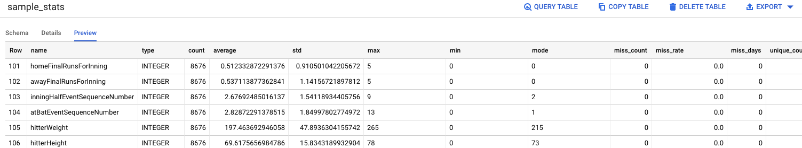

# BigQuery Profiler

Google BigQueryに任意のSQLクエリを発行し、その結果の統計情報を取得します。
モードは次の3つがあります。

* DataFrame Describe
* BigQuery SQL
* Pandas Profiling

選択できる出力先はモードにより異なりますが、CSV、BQテーブル、HTMLがあります。
ファイルの場合は`gs://~`にも対応しています。

# Installation

次のようにインストールできます。
`bq_profile`スクリプト中では`docker run ... colorfulboard/bq_profile:latest ...`を実行しています。

```shell
$ curl https://raw.githubusercontent.com/COLORFULBOARD/bq_profile/master/bq_profile > bq_profile
$ chmod +x bq_profile
$ mv bq_profile /usr/local/bin/bq_profile
```

バージョンが表示されたらインストール成功です。

```shell
$ bq_profile -v
x.x.x
```

# How to use

こんなコマンドを実行すると、クエリ結果の統計情報がBQ上に書き込まれます。

```shell
$ bq_profile local \
  --sql "SELECT * FROM \`bigquery-public-data.baseball.games_post_wide\`;" \
  --project myproject \
  --mode sql \
  --output-table temporary.sample_stats
```



モードによらず共通のオプションは次のとおりです。

* `local`: 実行時にGCP認証情報(`~/.config/gcloud`)をマウントします。
* `--sql`: クエリ文字列かそれを記述したファイルパス
* `--project`: GCPのプロジェクトID
* `--mode[default: describe]`: `describe`,`pandas-profiling`,`sql`のいずれかです

## Authentication

GCPの認証情報を利用します。

ローカルで個人のユーザアカウントの認証情報を利用する際は `bq_profile local ...` と`local`キーワードを入れてください。
GCEインスタンス上などのGCPのサービスアカウントの認証情報を利用する際は`local`は不要です。

現時点ではJSON形式の認証情報は未サポートです。

## Getting statistics

次の3つのモードから選択できます。

* DataFrame Describe
* BigQuery SQL
* Pandas Profiling

データ型はクエリ結果に依存するため、変更したい場合はクエリでキャストしてください。

### DataFrame Describe

* `--output`: アウトプットCSVファイルパス。`gs://`もOK。

### BigQuery SQL

* `--output`: アウトプットCSVファイルパス。`gs://`もOK。
* `--output-table`: `dataset.table`形式のBQテーブル名。`--output`よりも優先される。
* `--disposition`: `--output-table`が既に存在する場合の動きを指定します。`fail`,`replace`,`append`のいずれかです。

### Pandas Profiling

* `--output`: アウトプットHTMLファイルパス。`gs://`もOK。

# Upgrading

新しいバージョンがある場合は、`upgrade`コマンドでアップデートします。

```shell
$ bq_profile upgrade
upgrading...
done
```

# Contribution

## Profiler Development

[profiler.basic.Profiler](https://github.com/COLORFULBOARD/bq_profile/blob/master/profiler/basic.py#L5)を継承すると自由にプロファイラを追加できます。
プロファイラの登録は変数[bq_profile.PROFILER](https://github.com/COLORFULBOARD/bq_profile/blob/master/bq_profile.py#L7)で管理しています。
コマンド引数は全部インスタンス化時に渡されます。

## Test

ビルドしたDockerイメージでテストコードを実行します。

```shell
$ make test
```

## Run

ビルドしたDockerイメージを実行します。

```shell
# CMDにbq_profile以降に渡す文字列を全て渡します
$ make run CMD='--project etl-management --sql "SELECT * FROM \`bigquery-public-data.baseball.games_post_wide\`;"'
```

